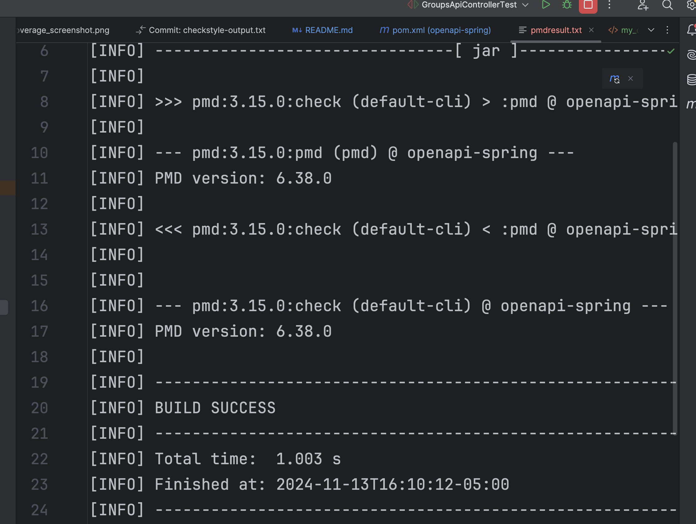
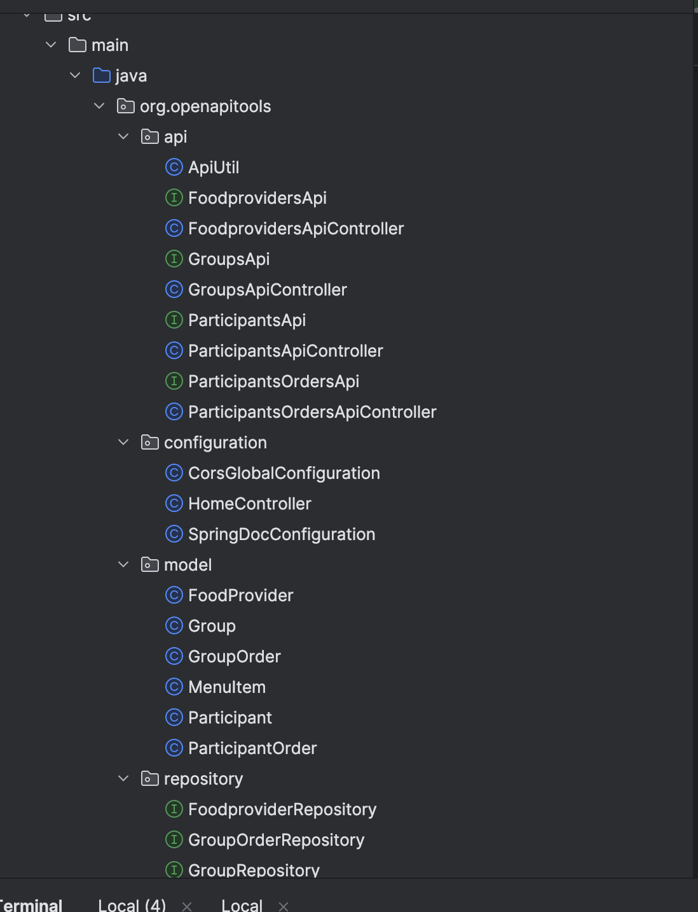

# Cloud computing Project - GroupGrub

## Building and Running a Local Instance

In order to build and use this service you must install the following (This guide assumes Mac but the Maven README has instructions for both Windows and Mac):

1. Maven 3.9.9: https://maven.apache.org/download.cgi Download and follow the installation instructions, be sure to set the bin as described in Maven's README as a new path variable by editing the system variables if you are on windows or by following the instructions for MacOS.
2. OpenJDK 22: This project used OpenJDK 22 for development so that is what We recommend you use: https://formulae.brew.sh/formula/openjdk
3. IntelliJ IDE: We recommend using IntelliJ but you are free to use any other IDE that you are comfortable with: https://www.jetbrains.com/idea/download/?section=mac
4. When you open IntelliJ you have the option to clone from a GitHub repo, click the green code button and copy the http line that is provided there and give it to your IDE to clone.
5. To set up the database credentials (which is mandatory for running this project), if you are running it in terminal, source a script of this format:

```
#!/bin/bash

export GROUPGRUB_DB_URL=jdbc:mysql://{$YOUR_DB_IP}:3306/{$YOUR_DB_NAME}
export GROUPGRUB_DB_USER={$YOUR_DB_USER}
export GROUPGRUB_DB_PASSWORD={$YOUR_DB_PASSWORD}
```

Also, add these environment variables in IntelliJ run configuration.

1. `cd` to the repository folder in Terminal. In order to set up the project with maven you can run `mvn clean install` and then you can either run the tests via the test files described below or run the main application from your IDE. You can use `mvn clean package` to package the project too.
2. If you wish to run the style checker you can with `mvn checkstyle:check` or `mvn checkstyle:checkstyle` if you wish to generate the report.

## Running Tests

The unit tests are located under the directory `src/test`. To run the project's tests in IntelliJ using Java 22, you must first build the project.

From there, you can right-click any of the test files present in the `src/test` directory and click run to see the results.

## mvn checkstyle:check

You can run the command `mvn checkstyle:check > checkstyle-output.txt` to verify if the repository adheres to Google's Java style guide. In this case, the check passed successfully with no violations or warnings.


## Endpoints

This section describes the endpoints that the service provides, as well as their inputs and outputs.

### Participants

#### GET /participants

- **Expected Input Parameters:** N/A
- **Expected Output:** A JSON array containing all participants.
- **Description:** Retrieves all participants registered in the service.
- **Upon Success:** HTTP 200 Status Code is returned along with the participants list in the response body.
- Upon Failure:
  - HTTP 404 Status Code with "No participants found" in the response body.

#### POST /participants

- **Expected Input Parameters:** A JSON object containing participant details.
- **Expected Output:** A JSON object containing the added participant's details.
- **Description:** Adds a new participant.
- **Upon Success:** HTTP 201 Status Code is returned along with the participant details in the response body.
- Upon Failure:
  - HTTP 400 Status Code with "Failed to add participant" in the response body.

#### GET /participants/{participantID}

- **Expected Input Parameters:** participantID (String)
- **Expected Output:** A JSON object containing the details of the specified participant.
- **Description:** Retrieves details of a participant by participantID.
- **Upon Success:** HTTP 200 Status Code is returned along with the participant details in the response body.
- Upon Failure:
  - HTTP 404 Status Code with "Participant not found" in the response body.

#### PUT /participants/{participantID}

- **Expected Input Parameters:** participantID (String), A JSON object containing participant details.
- **Expected Output:** A JSON object containing the updated participant's details.
- **Description:** Updates a participant's details.
- **Upon Success:** HTTP 200 Status Code is returned along with the updated participant details in the response body.
- Upon Failure:
  - HTTP 400 Status Code with "Failed to update participant" in the response body.
  - HTTP 404 Status Code with "Participant not found" in the response body.

#### DELETE /participants/{participantID}

- **Expected Input Parameters:** participantID (String)
- **Expected Output:** N/A
- **Description:** Deletes a participant.
- **Upon Success:** HTTP 204 Status Code is returned.
- Upon Failure:
  - HTTP 404 Status Code with "Participant not found" in the response body.

#### GET /participants/{participantID}/orders

- **Expected Input Parameters:** participantID (String)
- **Expected Output:** A JSON array containing all orders for the specified participant.
- **Description:** Retrieves all participant orders for a specific participant.
- **Upon Success:** HTTP 200 Status Code is returned along with the participant orders in the response body.
- Upon Failure:
  - HTTP 404 Status Code with "No participant orders found" in the response body.

#### POST /participants/{participantID}/orders

- **Expected Input Parameters:** participantID (String), A JSON object containing participant order details.
- **Expected Output:** A JSON object containing the added participant's order details.
- **Description:** Creates a new participant order.
- **Upon Success:** HTTP 201 Status Code is returned along with the participant order details in the response body.
- Upon Failure:
  - HTTP 400 Status Code with "Failed to create a new order" in the response body.

#### GET /participants/{participantID}/orders/{participantOrderID}

- **Expected Input Parameters:** participantID (String), participantOrderID (String)
- **Expected Output:** A JSON object containing the details of the specified participant's order.
- **Description:** Retrieves a specific participant's order.
- **Upon Success:** HTTP 200 Status Code is returned along with the participant order details in the response body.
- Upon Failure:
  - HTTP 404 Status Code with "Order not found" in the response body.

#### PUT /participants/{participantID}/orders/{participantOrderID}

- **Expected Input Parameters:** participantID (String), participantOrderID (String), A JSON object containing participant order details.
- **Expected Output:** A JSON object containing the updated participant's order details.
- **Description:** Updates a participant's order.
- **Upon Success:** HTTP 200 Status Code is returned along with the updated participant order details in the response body.
- Upon Failure:
  - HTTP 400 Status Code with "Failed to update order" in the response body.
  - HTTP 404 Status Code with "Order not found" in the response body.

#### DELETE /participants/{participantID}/orders/{participantOrderID}

- **Expected Input Parameters:** participantID (String), participantOrderID (String)
- **Expected Output:** N/A
- **Description:** Deletes a participant's order.
- **Upon Success:** HTTP 204 Status Code is returned.
- Upon Failure:
  - HTTP 404 Status Code with "Order not found" in the response body.

### Groups

#### GET /groups/getAllGroups

- **Expected Input Parameters:** N/A
- **Expected Output:** A JSON array containing all groups.
- **Description:** Retrieves a list of all groups in the service.
- **Upon Success:** HTTP 200 Status Code is returned along with the groups list in the response body.
- Upon Failure:
  - HTTP 404 Status Code with "No groups found" in the response body.

#### POST /groups

- **Expected Input Parameters:** A JSON object containing group details.
- **Expected Output:** A JSON object containing the added group's details.
- **Description:** Adds a new group to the service.
- **Upon Success:** HTTP 201 Status Code is returned along with the group details in the response body.
- Upon Failure:
  - HTTP 400 Status Code with "Failed to add a new group" in the response body.

#### GET /groups/{groupId}

- **Expected Input Parameters:** groupId (String)
- **Expected Output:** A JSON object containing the details of the specified group.
- **Description:** Retrieves details of a specific group.
- **Upon Success:** HTTP 200 Status Code is returned along with the group details in the response body.
- Upon Failure:
  - HTTP 404 Status Code with "Group not found" in the response body.

#### PUT /groups/{groupId}

- **Expected Input Parameters:** groupId (String), A JSON object containing group details.
- **Expected Output:** A JSON object containing the updated group's details.
- **Description:** Updates a group's details.
- **Upon Success:** HTTP 200 Status Code is returned along with the updated group details in the response body.
- Upon Failure:
  - HTTP 404 Status Code with "Group not found" in the response body.

#### DELETE /groups/{groupId}

- **Expected Input Parameters:** groupId (String)
- **Expected Output:** N/A
- **Description:** Deletes a group.
- **Upon Success:** HTTP 204 Status Code is returned.
- Upon Failure:
  - HTTP 404 Status Code with "Group not found" in the response body.

#### GET /groups/{groupId}/orders

- **Expected Input Parameters:** groupId (String)
- **Expected Output:** A JSON array containing all orders for the specified group.
- **Description:** Retrieves all group orders for a specific group.
- **Upon Success:** HTTP 200 Status Code is returned along with the group orders in the response body.

#### POST /groups/{groupId}/orders

- **Expected Input Parameters:** groupId (String), A JSON object containing group order details.
- **Expected Output:** A JSON object containing the added group's order details.
- **Description:** Creates a new group order.
- **Upon Success:** HTTP 201 Status Code is returned along with the group order details in the response body.

#### GET /groups/{groupId}/orders/{orderId}

- **Expected Input Parameters:** groupId (String), orderId (String)
- **Expected Output:** A JSON object containing the details of the specified group order.
- **Description:** Retrieves details of a specific group order.
- **Upon Success:** HTTP 200 Status Code is returned along with the group order details in the response body.
- Upon Failure:
  - HTTP 404 Status Code with "Group order not found" in the response body.

#### PUT /groups/{groupId}/orders/{orderId}

- **Expected Input Parameters:** groupId (String), orderId (String), A JSON object containing group order details.
- **Expected Output:** A JSON object containing the updated group order's details.
- **Description:** Updates a group order.
- **Upon Success:** HTTP 200 Status Code is returned along with the updated group order details in the response body.
- Upon Failure:
  - HTTP 400 Status Code with "Failed to update the group order" in the response body.

#### DELETE /groups/{groupId}/orders/{orderId}

- **Expected Input Parameters:** groupId (String), orderId (String)
- **Expected Output:** N/A
- **Description:** Deletes a group order.
- **Upon Success:** HTTP 204 Status Code is returned.
- Upon Failure:
  - HTTP 404 Status Code with "Group order not found" in the response body.

### Food Providers

#### GET /foodproviders

- **Expected Input Parameters:** N/A
- **Expected Output:** A JSON array containing all food providers.
- **Description:** Retrieves a list of all food providers.
- **Upon Success:** HTTP 200 Status Code is returned along with the food providers list in the response body.
- Upon Failure:
  - HTTP 404 Status Code with "No food providers found" in the response body.

#### POST /foodproviders

- **Expected Input Parameters:** A JSON object containing food provider details.
- **Expected Output:** A JSON object containing the added food provider's details.
- **Description:** Adds a new food provider to the service.
- **Upon Success:** HTTP 201 Status Code is returned along with the food provider details in the response body.
- Upon Failure:
  - HTTP 400 Status Code with "Failed to add food provider" in the response body.

#### GET /foodproviders/{foodProviderId}

- **Expected Input Parameters:** foodProviderId (String)
- **Expected Output:** A JSON object containing the details of the specified food provider.
- **Description:** Retrieves details of a specific food provider.
- **Upon Success:** HTTP 200 Status Code is returned along with the food provider details in the response body.
- Upon Failure:
  - HTTP 404 Status Code with "Food provider not found" in the response body.

#### PUT /foodproviders/{foodProviderId}

- **Expected Input Parameters:** foodProviderId (String), A JSON object containing food provider details.
- **Expected Output:** A JSON object containing the updated food provider's details.
- **Description:** Updates a food provider's details.
- **Upon Success:** HTTP 200 Status Code is returned along with the updated food provider details in the response body.
- Upon Failure:
  - HTTP 400 Status Code with "Failed to update food provider" in the response body.
  - HTTP 404 Status Code with "Food provider not found" in the response body.

#### DELETE /foodproviders/{foodProviderId}

- **Expected Input Parameters:** foodProviderId (String)
- **Expected Output:** N/A
- **Description:** Deletes a food provider.
- **Upon Success:** HTTP 204 Status Code is returned.
- Upon Failure:
  - HTTP 404 Status Code with "Food provider not found" in the response body.

## Style Checking Report

We used the tool "checkstyle" to check the style of the code and generate style checking reports. Here is the report as of the day of 2024/10/16 (these can be found in the images folder):

 

## Branch Coverage Reporting

We used JaCoCo to perform branch analysis in order to see the branch coverage of the relevant code within the code base. See below for screenshots demonstrating output.


# Static Analysis result

We used PMD as our static analysis tool and fixed all detected issues. You can run the following command to view the results

```
mvn pmd:check > pmdresult.txt
```

A screenshot of the results is also attached.



# End-to-End Testing Document

This document outlines comprehensive end-to-end tests for validating the APIs. Each section includes detailed test cases with sample input data, expected outputs, and manual testing instructions.

## Test Environment

- **Testing Tools**: Recommended tools include Postman, Curl, or other REST clients.
- **Base URL**: Assuming the application is hosted at `http://localhost:8080/api`.
- **Data Preparation**: In cases where IDs are not predefined, generate random UUIDs for testing.

## Table of Contents

- FoodProvider CRUD Operations
- Group CRUD Operations
- Participant CRUD Operations
- ParticipantOrder CRUD Operations
- Manual Testing Checklist

------

### FoodProvider CRUD Operations

#### Add a New FoodProvider (Success)

- Request

  :

  - **Method**: `POST`

  - **URL**: `/foodproviders`

  - Body

    :

    ```json
    {
      "name": "TestFoodProvider",
      "phoneNumber": "1234567890",
      "hoursOfOperation": "8hours",
      "location": "San Francisco",
      "menu": [
        {
          "name": "Burger",
          "image": "https://news.bk.com/media-assets/menu-item-and-campaign-images",
          "description": "A delicious beef burger",
          "cost": 11.00
        },
        {
          "name": "Fried chicken",
          "image": "https://www.allrecipes.com/recipe/8805/crispy-fried-chicken/",
          "description": "Crispy golden fried chicken",
          "cost": 11.00
        }
      ]
    }
    ```

- Expected Result

  :

  - **Status Code**: `201 Created`

#### Add FoodProvider with Missing Menu (Failure)

- Request

  :

  - **Method**: `POST`

  - **URL**: `/foodproviders`

  - Body

    :

    ```json
    {
      "name": "Test Provider",
      "phoneNumber": "1234567890"
    }
    ```

- Expected Result

  :

  - **Status Code**: `400 Bad Request`

#### Delete FoodProvider (Success)

- Request

  :

  - **Method**: `DELETE`
  - **URL**: `/foodproviders/{foodProviderId}`

- Expected Result

  :

  - **Status Code**: `204 No Content`

#### Retrieve FoodProvider by ID (Success)

- Request

  :

  - **Method**: `GET`
  - **URL**: `/foodproviders/{foodProviderId}`

- Expected Result

  :

  - **Status Code**: `200 OK`

------

### Group CRUD Operations

#### Retrieve All Groups (Success)

- Request

  :

  - **Method**: `GET`
  - **URL**: `/groups`

- Expected Result

  :

  - **Status Code**: `200 OK`

#### Retrieve Group by ID (Not Found)

- Request

  :

  - **Method**: `GET`
  - **URL**: `/groups/{groupId}`

- Expected Result

  :

  - **Status Code**: `404 Not Found`

------

### Participant CRUD Operations

#### Add Participant (Success)

- Request

  :

  - **Method**: `POST`

  - **URL**: `/participants`

  - Body

    :

    ```json
    {
      "name": "John Doe",
      "participantID": "123e4567-e89b-12d3-a456-426614174001"
    }
    ```

- Expected Result

  :

  - **Status Code**: `201 Created`

#### Retrieve All Participants (Not Found)

- Request

  :

  - **Method**: `GET`
  - **URL**: `/participants`

- Expected Result

  :

  - **Status Code**: `404 Not Found`

------

### ParticipantOrder CRUD Operations

#### Retrieve All Orders for a Participant (Success)

- Request

  :

  - **Method**: `GET`
  - **URL**: `/participants/{participantId}/orders`

- Expected Result

  :

  - **Status Code**: `200 OK`

#### Update Participant Order (Success)

- Request

  :

  - **Method**: `PUT`

  - **URL**: `/participants/{participantId}/orders/{orderId}`

  - Body

    :

    ```json
    {
      "comments": "Updated comments",
      "menuItemIDs": {}
    }
    ```

- Expected Result

  :

  - **Status Code**: `200 OK`

------

Here is a document explaining how `Mock` and `Mockito` are used in the provided unit tests, demonstrating how mocking is applied to simulate the behavior of the service layer, allowing focused testing of the controller logic without external dependencies.

## Mocking in the Tests

`@Mock` and `Mockito` are used to simulate behavior, enabling predictable test outcomes and avoiding side effects from real service interactions.

- Creating Mocks:

  ```java
  @Mock
  private Service service;
  ```

- Specifying Mock Behavior:

  ```java
  Mockito.when(service.methodCall(Mockito.any()))
         .thenReturn(true);
  ```

- Verifying Method Calls:

  ```java
  Mockito.verify(service, Mockito.times(1)).methodCall(Mockito.any());
  ```

This approach isolates logic under test and ensures that the code behaves as expected when service methods are invoked.

### Grouping of Testing Files

Source and test files are organized into corresponding groups. This structure helps maintain consistency and makes it easy to locate and manage related files.



### Manual Testing Checklist

1. **Set Up Initial Data**: Ensure all entities are created or available as needed.
2. **Verify API Response Codes and Content**: Use Postman or Curl to send requests to each endpoint. Check actual responses against expected results.
3. **Log Each Result**: Record whether each test passed or failed.
4. **Repeat Tests as Needed**: Re-run tests as the application evolves.

## Third-party code

The initial project skeleton is generated using openapi-generator with OpenAPI specs provided by the team. Certain auto-generated files are excluded from test reports.

## Tools used

- Maven
- Checkstyle
- JUnit
- JaCoCo
- openapi-generator
- Trello
